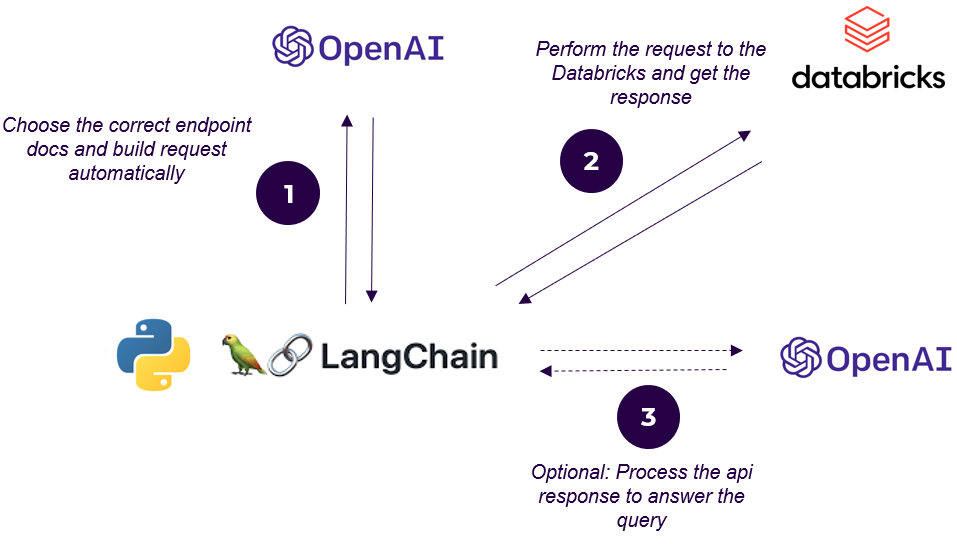

# Introduction 
This repo contains a CLI which can perform interactions with the Databricks API by using natural language.
This functionality is enabled by Langchain and Large Language Models (LLMs).
The code is tested with text-davinci-003 from OpenAI with the configuration in llm.yaml. Every OpenAI model can be used in the configuration llm.yaml.

# General
You can either install the CLI directly or use the repository directly with python.py databricks_llm.py \[OPTIONS\] COMMAND \[ARGS\].

# Getting Started
1. Dependencies
* All necessary dependencies are included in the requirements.txt and should be installed in a virtual environment. (e.g. pip install -r requirements.txt)
2. Installation of the CLI:
* python setup.py bdist_wheel
* pip install .\dist\databricks_llm-0.0.1-py3-none-any.whl
3. The following environment variables always need to be set:
* OPENAI_API_KEY = ... (Your access key from OpenAI or Azure OpenAI)
* DATABRICKS_HOST = ... (The host name in the form "adb-\<workspace-id\>.azuredatabricks.net")
* DBR_BEARER_TOKEN = ... (A personal access token for your workspace)
4. If you want to use the **AzureOpenAI** Service, please add the following environment variables:
* OPENAI_API_TYPE = "azure" (example)
* OPENAI_API_VERSION= "2023-05-15" (example)
* OPENAI_API_BASE = "https://\<resource-name\>.openai.azure.com/"
5. The **llm.yaml** config:
* This contains the parameters for the Large Langugage Model.
* **For AzureOpenAI the entry "deployment_name" needs to be present, otherwise please remove it**

# Functionalities
This repo contains several functionalities around Databricks Jobs/Workflows and their permissions as well as functionalities around MLflow models that are stored within a Databricks workspace. The commands and their descriptions can be accessed with the --help option.

# Example workflows
* Jobs:
    * Get particular job infos: databricks_llm jobs "Please return a list of all jobs; Figure out individual job configuration and only return the job names with tags 'NLP' and their jobID summarized:"
* Permissions:
    * Add a permission entry: databricks_llm permissions "Please add an entry in the list for the group: '\<group_name\>' with permission 'CAN_VIEW'" "\<workflow_id\>"
    * Modify a permission entry: databricks_llm permissions "Please modify the entry in the list for the group: '\<group_name\>' to permission 'CAN_MANAGE'" "\<workflow_id\>"  
* Machine Learning:
    * Get model infos: databricks_llm ml get-model-info "Please give me all infos for the model '\<model_name\>'"
    * Get infos about a run: databricks_llm ml get-run-info "\<run-id\>" "Please return the f1 score"
    * Transition a model: databricks_llm ml transition-model "Please transition model '\<model_name\>' version 6 into stage 'Production' and archive the current model in production"

# Overview of the workflows
